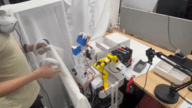
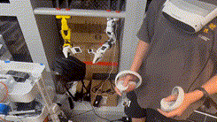
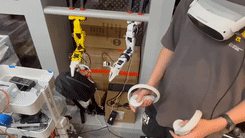
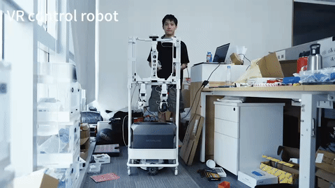

# LeRobot VR Controller

ROS2 package for SO-ARM101 robot VR controller

## Demo

|                 VR Teleoperation                  |                 Dual Arm Control                  |                 Chassis Control                  |
| :-----------------------------------------------: | :-----------------------------------------------: | :----------------------------------------------: |
|  |  |  |

|                  VR Control Robot                   |
| :-------------------------------------------------: |
|  |

## Overview

This ROS2 package provides a comprehensive VR-based teleoperation system for the SO-ARM101 robotic arm. It enables intuitive robot control through VR controllers by mapping VR headset and controller transforms to robot end-effector poses and joint commands.

**Key Features:**

- **VR Teleoperation**: Real-time transformation from VR controller poses to robot end-effector positions using inverse kinematics, with VR trigger-based gripper control and dynamic calibration system
- **Dual Arm Control**: Support for single arm (left/right) or simultaneous dual arm operation with independent topic remapping and synchronized control
- **Chassis Control**: Integrated mobile base control through VR joystick inputs for coordinated arm-chassis manipulation tasks

**Architecture:**

The system consists of three main components:
1. **VR TF Receiver**: Subscribes to VR transforms and joystick inputs, performs IK solving
2. **Robot Control Interface**: Manages motor commands with queue-based execution and state monitoring  
3. **Chassis Controller**: Handles mobile base motion commands

**Supported Hardware:**

- SO-ARM101 robotic arm with STS3215 servo motors
- VR headsets with 6-DOF tracking (tested with common VR platforms)
- Optional mobile chassis with differential drive

## System Requirements

- **Operating System**: Ubuntu 22.04 LTS
- **ROS Version**: ROS2 Humble Hawksbill
- **Compiler**: C++17 compatible compiler (GCC 9.0+, Clang 5.0+)
- **Python**: Python 3.10+

## Dependencies Installation

### System Dependencies

```bash
sudo apt update
sudo apt install -y \
    libnlopt-dev \
    libyaml-cpp-dev \
    nlohmann-json3-dev \
    liborocos-kdl-dev
```

### ROS2 Dependencies

Install required ROS2 packages:

```bash
sudo apt install -y \
    ros-humble-rclcpp \
    ros-humble-std-msgs \
    ros-humble-sensor-msgs \
    ros-humble-geometry-msgs \
    ros-humble-tf2 \
    ros-humble-tf2-ros \
    ros-humble-tf2-geometry-msgs \
    ros-humble-tf2-kdl \
    ros-humble-urdf \
    ros-humble-robot-state-publisher \
    ros-humble-joint-state-publisher \
    ros-humble-joint-state-publisher-gui \
    ros-humble-rviz2 \
    ros-humble-xacro \
    ros-humble-kdl-parser
```

## Build Instructions

Use `colcon` to build the package:

```bash
colcon build --packages-select lerobot_vr_controller
```

## Launch Instructions

### Launch VR Controller

**Single Arm Control (Left Arm):**

```bash
ros2 launch lerobot_vr_controller vr_controller.launch.py arm_side:=left
```

**Single Arm Control (Right Arm):**

```bash
ros2 launch lerobot_vr_controller vr_controller.launch.py arm_side:=right
```

**Dual Arm Control:**

```bash
ros2 launch lerobot_vr_controller vr_controller.launch.py arm_side:=both
```

**With Custom Configuration Files:**

You can override default configuration files using additional parameters:

```bash
ros2 launch lerobot_vr_controller vr_controller.launch.py \
    arm_side:=left \
    chassis_config_file:=/path/to/custom/chassis_config.yaml
```

**Available Parameters:**

- `arm_side`: Arm side selection (`left`, `right`, or `both`). Default: `right`
- `urdf_file`: Path to the URDF model file
- `joint_motor_config_file`: Path to joint motor configuration file
- `motor_calibration_file`: Path to motor calibration JSON file
- `chassis_config_file`: Path to chassis configuration file

### Launch Robot Visualization

**Display Robot Model in RViz:**

```bash
ros2 launch lerobot_vr_controller display_robot.launch.py
```

## Configuration Files

### VR to Arm Mapping Configuration

**File Location**: `config/left_vr_to_arm.yaml` / `config/right_vr_to_arm.yaml`

This configuration file defines the mapping between VR controller frames and robot arm links, kinematics solver parameters, and joint control settings.

**Key Parameters:**

```yaml
vr_to_arm_tf:
  wrist_link: wrist_left  # Maps robot wrist link to VR controller frame
gripper_world_frame: base_link  # Robot base frame
vr_world_frame: world_vr  # VR world reference frame
end_effector_frame: gripper_frame_link  # End effector frame name

kinematics:
  solver_type: "xlerobot"  # IK solver type
  timeout: 0.005  # IK solver timeout (seconds)

ik_tolerances:
  position_tolerance: 0.03  # Position tolerance (meters)
  orientation_tolerance: 0.02  # Orientation tolerance (radians)
  max_reach: 0.4  # Maximum reachable distance (meters)

joy_config:
  trigger_config:
    trigger_to_gripper_scale: 0.0068  # Trigger to gripper position scale
    joint_name: gripper  # Gripper joint name
  axes_config:
    z_advance_scale: -0.0015  # Z-axis movement scale (meters)
    z_clockwise_rotate_scale: -0.03  # Z-axis rotation scale (radians)

joint_pose:
  home_pose:
    joint_name: [shoulder_pan, shoulder_lift, elbow_flex, wrist_flex, wrist_roll, gripper]
    position: [-0.019, -0.955, 1.0, 0.0, -0.021, 0.0]  # Home position for each joint

joint_filter:
  alpha: 0.5  # Low-pass filter coefficient for joint smoothing

enable_human_arm: false  # Enable human arm kinematics constraints
```

### Chassis Configuration

**File Location**: `config/chassis_config.yaml`

Configuration for mobile chassis control parameters.

**Key Parameters:**

```yaml
linear_vel_rate: 0.2  # Linear velocity scaling factor
angular_vel_rate: -0.2  # Angular velocity scaling factor (negative for inverted control)
vel_cmd_topic: "/vr/cmd_vel"  # Velocity command topic name
```

**Usage Notes:**
- `linear_vel_rate`: Multiplier for VR joystick Y-axis input to linear velocity
- `angular_vel_rate`: Multiplier for VR joystick X-axis input to angular velocity
- Negative values invert the control direction

### Motor Configuration

**File Location**: `config/motor/so101_follower/joint_motor_config.yaml`

Defines the mapping between joint positions (radians) and motor encoder positions for STS3215 servos.

**Key Parameters:**

```yaml
joint_motor_pos_mapping:
  shoulder_pan:
    motor_pos: 2047  # Motor encoder position at zero joint angle
    joint_pos: 0  # Joint angle in radians
  # ... (similar for other joints)

joint_to_motor_scale:
  shoulder_pan: 651.89  # Conversion factor: 1 radian = 651.89 motor ticks
  # ... (similar for other joints)
```

**Calibration Notes:**
- Motor center position is typically 2047 (12-bit encoder: 0-4095 range)
- Scale factor 651.89 is derived from: 4096 / (2π) ≈ 651.89 ticks/radian
- Adjust `motor_pos` values during calibration to match actual zero positions

**Calibration File**: `config/motor/so101_follower/motor_calibration.json`

Stores motor-specific calibration offsets. This file is generated/updated by the calibration process.

### Topic Remapping Configuration

**File Location**: `config/left_arm_remapping.yaml` / `config/right_arm_remapping.yaml`

Used for dual-arm setups to remap topics with arm-specific namespaces.

**Key Parameters:**

```yaml
topic:
  /vr_controller/joint_cmd: /left/vr_controller/joint_cmd
  /joint_states: /left/joint_states
  /robot_control/motor_cmd: /left/robot_control/motor_cmd
  /robot_control/motor_state: /left/robot_control/motor_state
  /tf: /left/tf
  /vr/controller_right/joy: /vr/controller_left/joy

node: left_lerobot_vr_controller  # Node name for remapped instance
```

**Usage:**
- Automatically loaded when `arm_side:=both` in launch file
- Left arm uses `left_arm_remapping.yaml` with `/left` namespace
- Right arm uses `right_arm_remapping.yaml` with `/right` namespace
- Enables independent control of two arms without topic conflicts

### VR TF Reply Configuration

**File Location**: `config/left_reply_vr_tf.yaml` / `config/right_reply_vr_tf.yaml`

Configuration for VR transform republishing script used in replay/playback scenarios.

## Contributors

- **Kaho**
- **Issac Sim**
- **Ryan**
- **Qi Liu**

## Sponsors

This project is sponsored by **MakerMods**.
